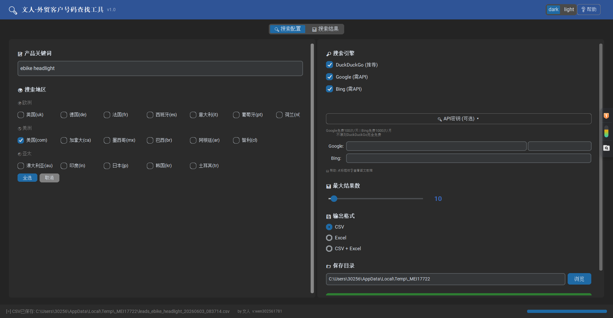
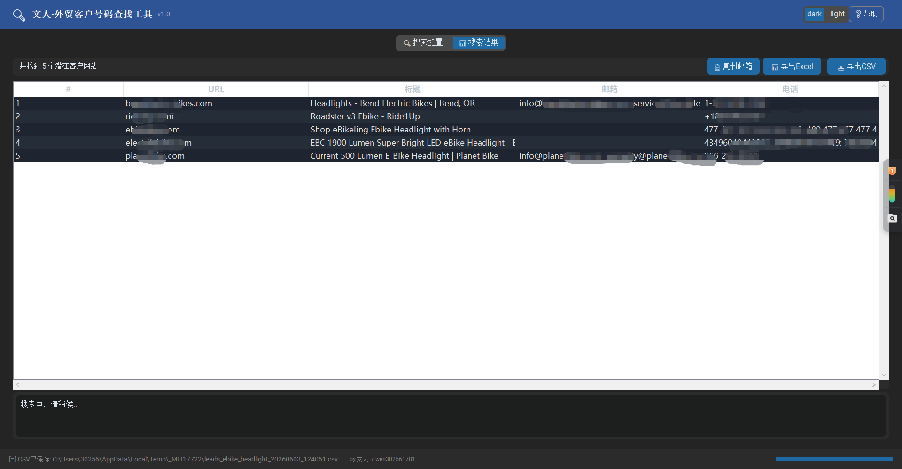

<p align="center">
  
  
  
  
  <br>
  
  
  
  <br>
  <a href="https://github.com/kaige158/LeadMiner/stargazers"></a>
  <a href="https://github.com/kaige158/LeadMiner/network/members"></a>
</p>

<h1 align="center">🔍 LeadMiner</h1>
<h3 align="center">外贸客户号码智能查找工具</h3>

<p align="center">
  <b>输入一个产品关键词 → 自动搜索全球企业网站 → 提取邮箱和电话号码 → 导出CSV/Excel</b>
  <br><br>
  <em>Type a product keyword → Auto-search business websites worldwide → Extract emails & phone numbers → Export to CSV/Excel</em>
</p>

<p align="center">
  <!-- 替换为你的 GIF 演示动画 -->
  
  <br>
  <sub>⬆️ 录一个 15-30 秒的操作演示 GIF 替换这里，效果翻倍 ⬆️</sub>
</p>

---

## 📖 目录 | Table of Contents

- [💡 为什么做这个项目 | Why LeadMiner](#-为什么做这个项目--why-leadminer)
- [✨ 核心功能 | Features](#-核心功能--features)
- [📸 界面截图 | Screenshots](#-界面截图--screenshots)
- [🎬 快速开始 | Quick Start](#-快速开始--quick-start)
- [🏗️ 技术架构 | Architecture](#️-技术架构--architecture)
- [🔧 搜索引擎对比 | Search Engine Comparison](#-搜索引擎对比--search-engine-comparison)
- [📊 支持的搜索地区 | Supported Regions](#-支持的搜索地区--supported-regions)
- [📦 打包为独立程序 | Build Standalone EXE](#-打包为独立程序--build-standalone-exe)
- [🛠️ 技术栈 | Tech Stack](#️-技术栈--tech-stack)
- [📁 项目结构 | Project Structure](#-项目结构--project-structure)
- [🚀 进阶使用 | Advanced Usage](#-进阶使用--advanced-usage)
- [🤝 贡献 | Contributing](#-贡献--contributing)

---

## 💡 为什么做这个项目 | Why LeadMiner

### 🇨🇳 中文

外贸业务员每天最大的痛点：**怎么找到国外客户的联系方式？**

传统方法是手动 Google 搜索 → 一个一个网站翻找 → 复制粘贴邮箱电话 → 整理到 Excel。一个关键词可能要花 2-3 小时。

**LeadMiner 把这个过程自动化了**：

| 😫 手动方式 | 🚀 LeadMiner |
|---------|-----------|
| 🐢 逐个网站翻找 | 🚀 自动搜索+批量分析 |
| 🌍 只搜一个国家 | 🌏 同时搜索 20+ 国家 |
| 🔍 一个搜索引擎 | ⚡ 三大引擎并行 |
| 🧹 手动过滤平台/新闻站 | 🎯 智能识别企业网站 |
| 📋 手动复制粘贴 | 📥 自动导出 CSV/Excel |
| ⏱️ 2-3 小时 | ⚡ 2-3 分钟 |

### 🇬🇧 English

The biggest pain for international trade professionals: **How to find overseas clients' contact info efficiently?**

Traditional workflow: Manual Google search → Browse websites one by one → Copy-paste emails/phones → Organize in Excel. One keyword could take 2-3 hours.

**LeadMiner automates this pipeline** — turning hours of manual work into a 2-minute operation.

---

## ✨ 核心功能 | Features

### 🔎 多引擎智能搜索 | Multi-Engine Search
- **DuckDuckGo** — Free, unlimited, most stable (recommended)
- **Google API** — 100 free queries/day, most accurate results
- **Bing API** — 1000 free queries/month, Microsoft ecosystem friendly
- Smart fallback: API unavailable → auto-downgrade to web scraping → suggest alternative engines

### 🌍 20+ 国家/地区定向搜索 | Multi-Region Targeting
覆盖欧美、亚太、拉美等主要外贸市场，每个地区使用对应语言的搜索引擎域名，结果更精准。

Targets major trade markets across Europe, Americas, and Asia-Pacific — each region uses localized search engine domains for precision.

### 🎯 智能企业网站识别 — 核心技术 | Smart Business Site Detection

不是简单的 URL 过滤，而是**多维度综合判断**。Not just URL filtering — a **multi-layer classification system**:

```
┌─────────────────────────────────────────────────┐
│  Layer 1: Domain Blacklist                        │
│    └─ 50+ platforms/e-commerce/social media       │
│                                                   │
│  Layer 2: URL Pattern Matching                     │
│    └─ marketplace/store/supplier paths detected    │
│                                                   │
│  Layer 3: Multi-Language Content Analysis          │
│    ├─ Business indicators (8 langs × 10+ words)   │
│    ├─ Product section detection (multilingual)     │
│    ├─ Copyright notice detection (© symbol)        │
│    └─ B2B navigation pattern (contact/about)       │
│                                                   │
│  Layer 4: Contact Info Extraction                  │
│    ├─ Homepage → Contact page auto-discovery       │
│    ├─ mailto:/tel: protocol link parsing           │
│    └─ Fake email/phone filtering                   │
└─────────────────────────────────────────────────┘
```

### 📧 联系信息提取 | Contact Extraction
- Regex + DOM parsing dual approach for maximum coverage
- Auto-discover contact pages (8 language path patterns)
- Filter fake emails (`example@`, `test@`, `noreply@`, etc.)
- Filter fake phone numbers (all-same-digits, date format, etc.)

### 🖥️ 双模式运行 | Dual Mode

| | 🖥️ CLI 命令行 | 🎨 GUI 桌面版 |
|---|---|---|
| **适用人群** | 开发者 / 自动化脚本 | 外贸业务员 / 非技术人员 |
| **批量处理** | ✅ 可脚本化 | 手动配置 |
| **可视化** | 终端文本输出 | 实时表格 + 详情 + 进度条 |
| **主题** | — | 深色/浅色一键切换 |
| **设置记忆** | — | ✅ 自动保存上次配置 |

### 📊 多种导出格式 | Export Options
- **CSV** (UTF-8 BOM, opens in Excel with no encoding issues)
- **Excel** (formatted headers, frozen top row, auto-filter)
- **One-click copy all emails** to clipboard

---

## 📸 界面截图 | Screenshots

<p align="center">
  <b>🎨 GUI 搜索配置页 | Search Configuration Panel</b>
  <br><br>
  <!-- 替换为实际截图 -->
  
  <br>
  <sub>关键词输入、地区勾选（按大洲分组）、搜索引擎选择、结果数滑块、API 密钥折叠面板</sub>
</p>

<br>

<p align="center">
  <b>📊 GUI 搜索结果页 | Results Table View</b>
  <br><br>
  <!-- 替换为实际截图 -->
  
  <br>
  <sub>实时表格展示、双击打开网站、一键导出 CSV/Excel/复制邮箱、引擎状态实时指示器</sub>
</p>

<br>

<p align="center">
  <b>🖥️ CLI 终端输出 | Command Line Output</b>
</p>

```
==============================================================
  [*] 外贸客户号码查找工具
==============================================================
  关键词: LED lights
  搜索地区: com, de, uk
  搜索引擎: duckduckgo, google, bing
  最大结果: 20
==============================================================

📡 第一步：搜索引擎搜索...
[@] 搜索地区: 美国 (com)
  [*] DDG搜索 (美国): region=us-en 最多25条
     DDG返回 25 条  →  获得 25 条 (累计 25 条)
[@] 搜索地区: 德国 (de)
  [*] DDG搜索 (德国): region=de-de 最多25条
     DDG返回 18 条  →  获得 18 条 (累计 43 条)

✅ 搜索完成，共获得 68 条去重结果

🔬 第二步：访问网站、提取联系信息...
[1/68] 正在访问: example-led-manufacturer.com
  [找到] example-led-manufacturer.com | 邮箱:2 电话:1
[2/68] 正在访问: another-led-supplier.de
  [找到] another-led-supplier.de | 邮箱:1 电话:2
...
✅ 网站分析完成，找到 15 个潜在客户

📁 结果已保存到: leads_LED_lights_20260531_235100.csv

~~~ 任务完成! ~~~
```

---

## 🎬 快速开始 | Quick Start

### 环境要求 | Requirements
- Python 3.10+
- pip

### 安装 | Installation

```bash
# 1. 克隆仓库
git clone https://github.com/kaige158/LeadMiner.git
cd LeadMiner

# 2. 安装依赖
pip install -r requirements.txt
```

### CLI 命令行模式

```bash
# 基础搜索（DuckDuckGo 美国站）
python number_finder.py "LED lights"

# 德国市场搜索 (搜索德语关键词)
python number_finder.py "LED Lampen" -c de

# 多国搜索（法国+德国+英国）
python number_finder.py "moteur électrique" -c fr de uk

# 指定搜索引擎 (必应西班牙站)
python number_finder.py "acero inoxidable" -c es -e bing

# 导出 Excel + 50条结果
python number_finder.py "steel pipe" -c com uk de -n 50 -o excel

# 列出所有支持的国家/地区
python number_finder.py --list-countries

# 详细日志模式（调试用）
python number_finder.py "LED lights" -v
```

### GUI 桌面模式 | Desktop GUI

```bash
# 启动图形界面
python number_finder_gui.py

# Windows 用户可直接双击
一键启动.bat
```

> 💡 打包后的 `.exe` 文件可直接发给非技术同事使用，无需安装 Python！

---

## 🏗️ 技术架构 | Architecture

```
┌──────────────────────────────────────────────────────────────┐
│                        LeadMiner                              │
├──────────────────────────────────────────────────────────────┤
│                                                               │
│  ┌──────────────┐  ┌──────────────┐  ┌──────────────────┐   │
│  │   CLI 入口    │  │   GUI 入口    │  │   打包脚本        │   │
│  │ number_finder │  │ number_finder│  │  build_exe.py    │   │
│  │    .py:main() │  │   _gui.py    │  │  PyInstaller     │   │
│  └──────┬───────┘  └──────┬───────┘  └──────────────────┘   │
│         │                 │                                   │
│         └────────┬────────┘                                   │
│                  │                                            │
│  ┌───────────────▼───────────────────────────────────────┐   │
│  │              核心引擎 (number_finder.py)                │   │
│  │                                                        │   │
│  │  ┌─────────────┐  ┌─────────────┐  ┌──────────────┐  │   │
│  │  │  搜索模块    │  │  分析模块    │  │   输出模块    │  │   │
│  │  │             │  │             │  │              │  │   │
│  │  │ • DuckDuckGo│  │ • 企业识别  │  │ • CSV 导出   │  │   │
│  │  │ • Google    │  │ • 邮箱提取  │  │ • Excel 导出  │  │   │
│  │  │ • Bing      │  │ • 电话提取  │  │ • 控制台打印  │  │   │
│  │  │ • API fallback│ • 联系页发现 │  │              │  │   │
│  │  └─────────────┘  └─────────────┘  └──────────────┘  │   │
│  │                                                        │   │
│  │  ┌─────────────────────────────────────────────────┐  │   │
│  │  │              智能过滤层 | Smart Filter Layer      │  │   │
│  │  │  • 平台域名黑名单 (50+ platform domains)         │  │   │
│  │  │  • 新闻/博客域名过滤 (news/blog patterns)        │  │   │
│  │  │  • 多语言企业特征匹配 (8 languages)              │  │   │
│  │  │  • 假邮箱/假号码过滤 (fake data filter)          │  │   │
│  │  └─────────────────────────────────────────────────┘  │   │
│  └───────────────────────────────────────────────────────┘   │
│                                                               │
└──────────────────────────────────────────────────────────────┘
```

### 设计亮点 | Design Highlights

1. **搜索引擎分层设计** — API 优先 → 直搜 fallback → 引擎切换建议，最大化成功率
2. **多语言架构** — 企业特征词库覆盖 8 种语言，字典驱动而非硬编码，极易扩展
3. **线程安全** — DDG 搜索带 30s 超时保护；GUI 搜索在后台线程运行，不阻塞界面
4. **实时回调** — `result_callback` + `stop_check` 设计，GUI 可实时展示进度并随时中止
5. **Windows 兼容** — Emoji 安全替换、UTF-8 编码强制配置、DPI 感知适配

---

## 🔧 搜索引擎对比 | Search Engine Comparison

| 特性 Feature | DuckDuckGo | Google API | Bing API |
|------|-----------|------------|----------|
| **费用 Cost** | 🆓 免费无限 | 🆓 100次/天 | 🆓 1000次/月 |
| **稳定性 Stability** | ⭐⭐⭐⭐⭐ | ⭐⭐⭐⭐ | ⭐⭐⭐⭐ |
| **结果质量 Quality** | ⭐⭐⭐ | ⭐⭐⭐⭐⭐ | ⭐⭐⭐⭐ |
| **需要密钥 API Key** | ❌ 不需要 | ✅ Key + CX | ✅ Key |
| **限流风险 Rate Limit** | 低 | 中 | 低 |
| **推荐场景** | 🥇 日常首选 | 🥈 精准搜索 | 🥉 备选方案 |

> 💡 **最佳实践**：日常使用 DuckDuckGo（免费稳定），重要客户开发时搭配 Google API。

---

## 📊 支持的搜索地区 | Supported Regions

| 地区 | 代码 | Google 域名 | 语言 | | 地区 | 代码 | Google 域名 | 语言 |
|------|------|-------------|------|--|------|------|-------------|------|
| 🇺🇸 美国 | `com` | google.com | en | | 🇧🇷 巴西 | `br` | google.com.br | pt |
| 🇬🇧 英国 | `uk` | google.co.uk | en | | 🇵🇹 葡萄牙 | `pt` | google.pt | pt |
| 🇩🇪 德国 | `de` | google.de | de | | 🇳🇱 荷兰 | `nl` | google.nl | nl |
| 🇫🇷 法国 | `fr` | google.fr | fr | | 🇯🇵 日本 | `jp` | google.co.jp | ja |
| 🇪🇸 西班牙 | `es` | google.es | es | | 🇰🇷 韩国 | `kr` | google.co.kr | ko |
| 🇮🇹 意大利 | `it` | google.it | it | | 🇷🇺 俄罗斯 | `ru` | google.ru | ru |
| 🇲🇽 墨西哥 | `mx` | google.com.mx | es | | 🇹🇷 土耳其 | `tr` | google.com.tr | tr |
| 🇨🇦 加拿大 | `ca` | google.ca | en | | 🇵🇱 波兰 | `pl` | google.pl | pl |
| 🇦🇺 澳大利亚 | `au` | google.com.au | en | | 🇸🇪 瑞典 | `se` | google.se | sv |
| 🇮🇳 印度 | `in` | google.co.in | en | | 🇦🇷 阿根廷 | `ar` | google.com.ar | es |
| | | | | | 🇨🇱 智利 | `cl` | google.cl | es |

> 每个地区使用对应语言的 Google/Bing 域名，搜索结果的本地化程度远超通用搜索。

---

## 📦 打包为独立程序 | Build Standalone EXE

```bash
# 一键打包为单个 .exe（适合分发）
python build_exe.py

# 打包为文件夹（启动更快，适合调试）
python build_exe.py --folder
```

打包输出在 `dist/` 目录，可直接发给没有 Python 环境的同事使用。

---

## 🛠️ 技术栈 | Tech Stack

| 层级 Layer | 技术 Tech | 用途 Purpose |
|------|------|------|
| **语言** | Python 3.10+ | 核心逻辑 |
| **HTTP 请求** | `requests` | 网页请求 + API 调用 |
| **HTML 解析** | `BeautifulSoup4` + `lxml` | 网页内容提取 |
| **搜索引擎** | `ddgs` / `googlesearch-python` | DuckDuckGo & Google 搜索 |
| **GUI 框架** | `CustomTkinter` | 现代化桌面界面 |
| **Excel 导出** | `openpyxl` | 格式化 Excel 输出 |
| **打包工具** | `PyInstaller` | 单文件 .exe 打包 |
| **并发** | `threading` | 搜索超时保护 + GUI 后台线程 |

---

## 📁 项目结构 | Project Structure

```
LeadMiner/
├── number_finder.py          # 🔥 核心引擎：搜索+分析+导出 (1200+ 行)
├── number_finder_gui.py      # 🖥️ GUI桌面应用 (CustomTkinter, 980+ 行)
├── api_guide.html            # 📖 API密钥申请图文教程（支持暗色/亮色主题）
├── build_exe.py              # 📦 PyInstaller 打包脚本
├── build_exe.bat             # 🪟 Windows 打包批处理
├── 一键启动.bat               # 🚀 Windows 一键启动（自动检测依赖）
├── requirements.txt          # 📋 Python 依赖清单
└── dist/                     # 📤 打包输出目录
    └── 文人·客户查找工具.exe   # 独立可执行文件
```

---

## 🚀 进阶使用 | Advanced Usage

### 作为 Python 库调用 | Import as a Library

```python
from number_finder import search_all, process_search_results, export_csv, export_excel

# 多国搜索
results = search_all(
    query="stainless steel pipe",
    countries=["com", "de", "uk", "br"],
    engines=["duckduckgo", "google"],
    max_results=30
)

# 分析网站提取联系信息
leads = process_search_results(
    search_results=results,
    keyword="stainless steel pipe",
    max_sites=20
)

# 导出
export_csv(leads, "stainless_steel_pipe", output_dir="./exports")
export_excel(leads, "stainless_steel_pipe", output_dir="./exports")
```

### 定时任务 | Scheduled Automation

```bash
# Linux cron: 每天早上9点自动搜索德国市场并导出Excel
0 9 * * * cd /path/to/LeadMiner && python number_finder.py "LED Lampen" -c de -n 30 -o excel

# Windows 任务计划程序: 定时运行 一键启动.bat
```

### 批量关键词挖掘 | Batch Processing

```bash
# 读取关键词列表，逐个搜索
while IFS= read -r keyword; do
    echo "搜索: $keyword"
    python number_finder.py "$keyword" -c de uk fr -n 20 -o excel
    sleep 60  # 礼貌间隔
done < keywords.txt
```

---

## 🤝 贡献 | Contributing

欢迎提交 Issue 和 Pull Request！所有贡献者将在 README 中致谢。

### 🗺️ 路线图 | Roadmap
- [ ] 支持更多搜索引擎（Yandex、Naver 等）
- [ ] 邮件批量发送集成
- [ ] CRM 客户关系管理功能
- [ ] 数据可视化分析面板
- [ ] 英文版国际化 UI
- [ ] Web 版（FastAPI + React）
- [ ] Docker 一键部署

### 📝 贡献指南 | How to Contribute
1. Fork 本仓库
2. 创建你的功能分支 (`git checkout -b feature/amazing-feature`)
3. 提交你的改动 (`git commit -m 'feat: add amazing feature'`)
4. 推送到分支 (`git push origin feature/amazing-feature`)
5. 打开一个 Pull Request

---

## ⭐ Star History

<a href="https://star-history.com/#kaige158/LeadMiner&Date">
  <picture>
    <source media="(prefers-color-scheme: dark)" srcset="https://api.star-history.com/svg?repos=kaige158/LeadMiner&type=Date&theme=dark" />
    <source media="(prefers-color-scheme: light)" srcset="https://api.star-history.com/svg?repos=kaige158/LeadMiner&type=Date&theme=default" />
    
  </picture>
</a>

> 💡 如果这个项目对你有帮助，**请给一个 ⭐ Star！** 你的支持是我持续改进的最大动力。
>
> *Found this helpful? **Give it a ⭐ Star** — it means a lot!*

---

## 📄 License

MIT © [kaige158](https://github.com/kaige158)

---

<p align="center">
  <sub>Built with ❤️ by <a href="https://github.com/kaige158">文人 (kaige158)</a></sub>
  <br>
  <sub>📧 联系 | Contact: v:wen302561781</sub>
</p>
